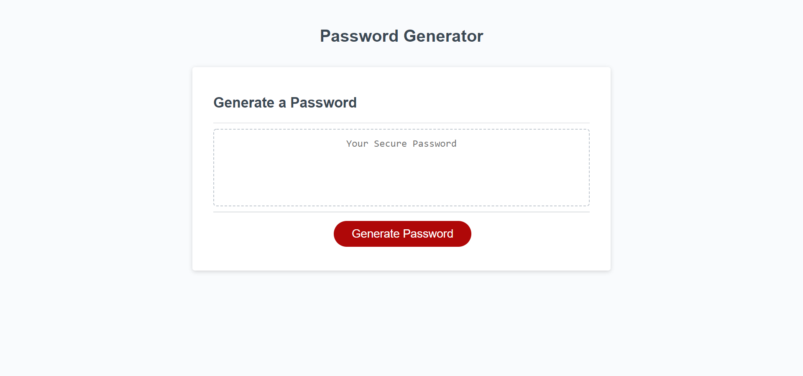

# Password-Generator-Jackson-Barker

Random password Generator.

# Created by:

Jackson Barker

# Password Generator Discription

This password generator will produce a random password for the user based on the following criteria,

- How many characters does the user want in the password?
- Does the user want lowercase letters?
- Does the user want uppercase letters?
- Does the user want numbers?
- Does the user want special characters?

# Usage

When the user clicks generate password they will be presented with a prompt asking them to enter the desired number of characters they would
like in their password. The prompt will be followed by a series of four confirms asking if the user would like lowercase letters, uppercase letters, numbers and special characters included in their password. If the user selects "ok" on the confirm then that particular confirm will be included in their new password, if they select "cancel" that particular confirm will not be included in their new password.

# Link

https://jackson-barker.github.io/Password-Generator-Jackson-Barker/

# Screen Shot

